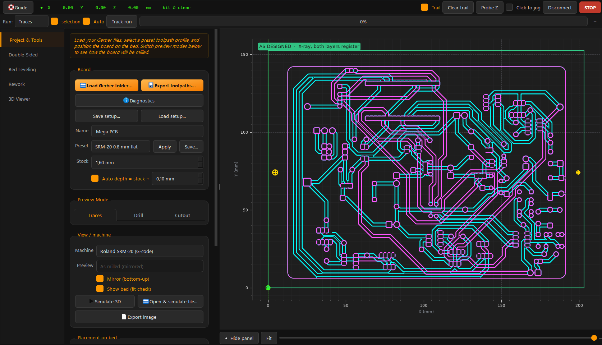
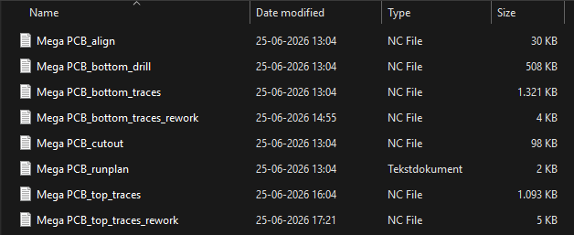
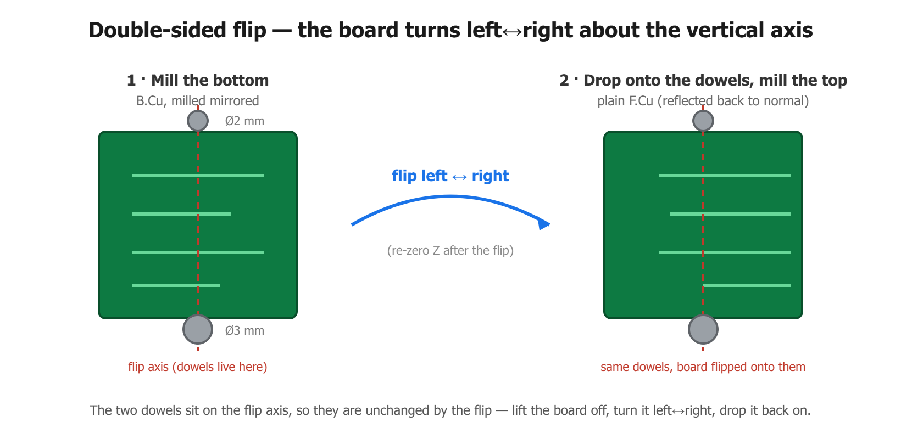
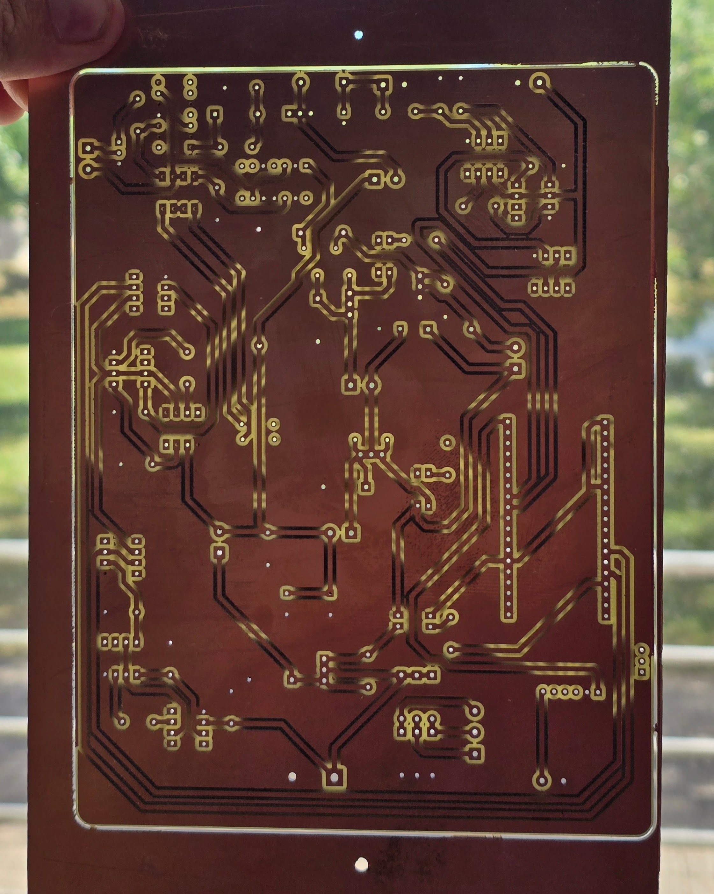
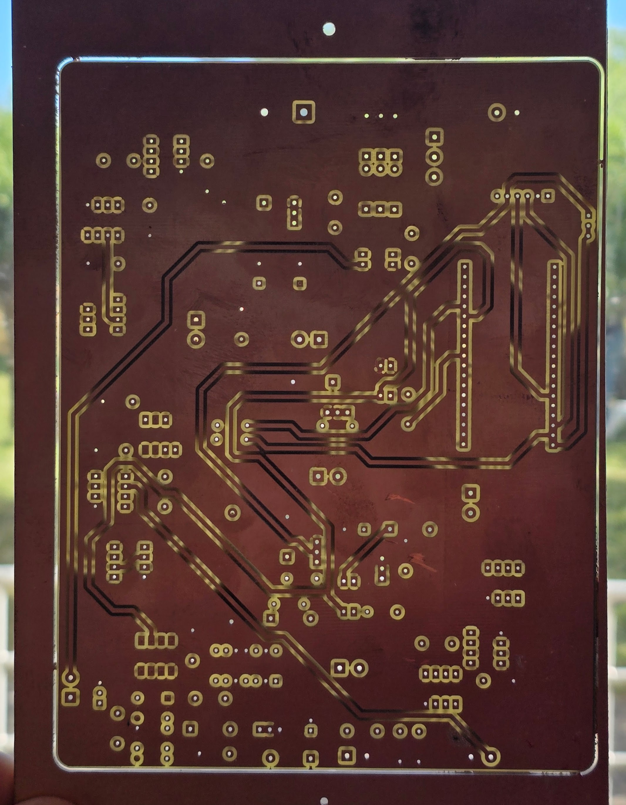

# DTU Ballerup PCB prototyping
Guide for producing PCB's from KiCad with DTU Ballerup equipment. 

<br>

## What will you need?
- [KiCad 9.0+](https://www.kicad.org/download/)
- A **single-sided**[^1] copper PCB FR4 board.
- Have participated in the safety course held by the professor or TA's.

<br>

## Contents
- [What to keep in mind](#what-to-keep-in-mind)
- [Making PCBs with the Fiber laser](#making-pcbs-with-the-fiber-laser)
- [Making PCBs with the Roland CNC router](#making-pcbs-with-the-roland-cnc-router)

<br>

## What to keep in mind
PCB's made in the course [62733](https://kurser.dtu.dk/course/62733) should preferably be made as **one-sided** PCB[^1]. Therefore, make sure to do all of your traces on the back side layer (B.Cu) in the KiCad PCB Editor:

> [!TIP]
> A quick way to check if you have selected the correct layer is, if the traces drawn becomes blue.
>
> If your traces are red, then you have selected the top layer (F.Cu).

It can also be a good idea to increase the size of traces for easier result consistency[^2].
> [!IMPORTANT]
> This step should be done **before** designing your PCB.
>
> It is **not possible to do afterwards.**

**To do so, do as shown in the *GIF*:**
1. Go into *Board Setup*, by clicking the small green circuit icon next to the save button.
2. Choose the *Net Classes* option under *Design Rules*:
3. Change *Clearance* to **0,8 mm** and *Track Width* to a minimum of **0,8 mm**, if possible then 1,0 mm and larger is prefered for working with most through-hole component PCB's made on the Fiber laser and CNC router.


<details>
  <summary><b>Step by step with pictures</summary>
  
   1. Go into *Board Setup*, by clicking the small green circuit icon next to the save button.

   

   2. Choose the *Net Classes* option under *Design Rules*:

   

   3. And change both *Clearance* and *Track Width* to 0,8 mm **minimum**. 1,0 mm and above, if possible, is prefered for working with most through-hole component PCB's made on the Fiber laser and CNC router.
  
</details>


<br>


## Making PCBs with the Fiber laser
- [Selecting the right components](#selecting-the-right-components)
- [Correcting your design for the Laser](#correcting-your-design-for-the-laser)
- [Exporting from KiCad](#exporting-from-kicad)
- [Preparing your PCB](#preparing-your-pcb)
- [Using the Fiber laser](#using-the-fiber-laser)


<br>

### Selecting the right components
Make sure that you have selected the proper footprints for your components. If you use components from the Component-shop on Ballerup Campus, use the footprints at the bottom of this guide [^3].


<br>

### Correcting your design for the Laser
Before moving to making your PCB on the Fiber laser, you'll need to add a *Filled zone* with some certain settings. We do this as a hack to isolate the traces, and save time and material when we use the Fiber laser. If we were to simply export a PCB with only the traces and an outline, the laser would remove everything but the traces, which would take longer, wear out the laser faster, and be more messy than simply removing a smaller area around the traces.

To create a proper *Filled zone* for the purpose of using the Fiber laser, do as shown in the GIF:


<details>
  <summary><b>Step by step with pictures</summary>
  
   1. Select the back cobber layer **B.Cu**.

   2. Select *Draw Filled Zones* from the toolbar on the right.

   3. Select your first corner of the PCB.

   4. Be sure that the *B.Cu* layer is selected, and that *\<no net\>* is selected.

   5. Change the following:
      - *Pad connections* to **None**.
      - *Clearance* to **0,75** mm.
      - *Minimum width* to **0,25** mm.
      - *Fill type* to **Solid fill**.

   6. Finish selecting the rest of your corners, until the board gains a hatched outline.

   7. Go into `Edit` and click `Fill All Zones`.
  
</details>


### Exporting from KiCad:
When choosing to make your PCB with the Fiber laser, you need to do the following steps in KiCad:
#### 1. Open the *Plot* window by going into:
`File - Fabrication Outputs - Gerbers (.gbr)`


#### 2. Change *Plot format* to **DXF**, and select where you wish to save your exported file:

Be sure to choose a folder you can find later, since you will need this file for the actual making of the PCB.


#### 3. In the *Plot* window, make sure that the following settings are selected:

Where the most important settings are as follows:
   - *Include Layers*: **B.Cu**.
   - *Plot on All Layers*: **Edge.Cuts**
   - *Drill marks*: **Small**
   - *Plot graphic items using their contours*: **Unselected**
   - *Plot drawing sheet*: **Unselected**
   - *Export units*: **Millimeters**

When the settings match the list above, export your DXF file by clicking *Plot*.


---

<br>

### Preparing your PCB

The most important step before going out and making or buying a PCB, is doing the your basic checks you learned in the course!
- Have you used the correct footprints?
- Have you designed your PCB on the correct size, and not flipped any components?
- Have you tried running the *Design Rule Checker* (DRC)?
- Have you added your own PCB board cutout in the `Edge.Cuts` layer?
If any of these steps have been skipped or done incorrectly, then making the PCB is a waste because its likely not working once you have it in your hand.

Before going out to find and cut a bare PCB board, take some measuments of your design in KiCad so you know how big to cut your PCB on the shear. Be sure to not going too tight with your measurments. Add around 2mm to your total width and length, so you don't risk your final board coming out too small.


When finding a bare PCB board:
- **Please don't use the boards with the blue film on**. They are not meant for the Fiber laser.
- Do not take a double-sided PCB board.

Ask for a proper bare PCB board if you are not able to find one.

After cutting your board to the correct size (plus your added 2~mm padding), take some 400 grit sandpaper and brush the surface a bit. **Don't overdo it!** We just need to remove the protective/oxide layer before moving onto the Fiber laser.

---

<br>

### Using the Fiber laser
> [!CAUTION]
> **Have you completed the safety course???**
>
> If not, then you are not allowed to use the machine! Please contact the course Professor or TA's, alternativly someone from BuildDesign Lab.

> [!IMPORTANT]
> Please have your **DXF file** and **pre-cut PCB** ready ***before booking the laser***
>
> Otherwise you will end up blocking the machine for others that may be prepared to use the machine.


1. Open the xTool software by clicking on the *xTool Creative Space* icon on the desktop, and create a new project, by clicking on the *X* icon in the top right corner of the window, or by opening a new tab.


2. In the top left corner, click on the **X** icon, then `File` and `Import image`.


3. Find your generated *dxf* file, and open it.


4. When the files is imported, **make sure to *flip* your design and make it *compound***.


5. When you select your design, you should see the right panel change. Select **Engrave**, and make sure that *Output* is green.


6. Confirm that your design looks something like this. **Note**, the black parts of the design will be **removed** by the laser.


> [!NOTE]
> The default import does not make the holes for the through-hole components.
> To fix this, and have the holes engraved as well, click on the icon next to the *Make compound* called **Edit compound**.
> Then select a hole and click delete on your keyboard, it should then become black like the rest of the engraving areas.
> Do this for every hole in your PCB design, untill they are all black.

7. Make sure that the sacrificial build-plate on the Laserbed, and lay your [**prepared board**](#preparing-your-pcb) onto the sacrificial build-plate. Try and get your design to be as much in the center of the machine as possible.

8. Now click on the *Framing* button in the lower right corner of the xTool window. A blue outline of your design will appear on the machinne. Use this box to align your [**prepared board**](#preparing-your-pcb) to where the machine will cut. 


Be sure that the framing box fit and does not spill over the edges.. If the *laser-frame* spills over the edges, then **do not cut!** Your PCB will likely come out wrong, and **you may damage the machine!**.

Also, if your board is cut too close to the final PCB size, it becomes quite difficult to get the alignment right. If its too tight, start over and cut a larger piece. It is much easier to cut your PCB to size **after** it has been engraved, rather than before.


9. If a picture of the machine bed is not shown within the software click on the camera icon next to the automatic height button.
**Make sure** that the design does not flow over the edges! You should strive to place your design as much in the middle of your board as possible.


10. Stop the framing, and then click the *Auto height ajustment* button, and wait for the machine to complete.


11. Click on the presets just beneith the *Engrave* Tab, and select the preset called *PCB*. Make sure that the cutting parameters match those on the pictures, or the updated settings given to you by your instructers, professor or TA's.


**This is your last chance to check if everything seems correct**.


> [!IMPORTANT]
> Please check the following:
> - Is my design mirrored on the Laser software? If not, mirror the design!
> - Is the Traces of my design white, and the area round it black? Remember that the black areas are removed, so if your traces are black, then your PCB is useless.
> - Have I cut the PCB board large enough and have I brushed the surface? If not, then go back and do so.
> - Is my cutting parameters all correct? If not, then go back and make sure the settings match the recommended settings.
> 


12. When everything is ready, click the *Process* button, and follow the steps for starting the machine.

When the machine is working, remember to not stare at the burn light on the PCB!


---

## Making PCBs with the Roland CNC router
The Roland monoFab **SRM-20** is a small desktop CNC mill. Instead of burning the copper away like the Fiber laser, it **mechanically cuts** thin isolation channels around your traces with a spinning endmill, drills the component holes, and cuts the finished board free — all in one setup. It's a good alternative when the laser is busy or unavailable.

- [Selecting the right components](#selecting-the-right-components-cnc)
- [Correcting your design for the CNC router](#correcting-your-design-for-the-cnc-router)
- [Exporting from KiCad](#exporting-from-kicad-cnc)
- [Generating the toolpaths with srm-cam](#generating-the-toolpaths-with-srm-cam)
- [Preparing your PCB](#preparing-your-pcb-cnc)
- [Using the SRM-20](#using-the-srm-20)
- [Double-sided boards (advanced)](#double-sided-boards-advanced)

<br>

### Selecting the right components (CNC)
Exactly the same as for the Fiber laser — single-sided, with all traces on the back layer (**B.Cu**) and the through-hole footprints listed at the bottom of this guide[^3].

<br>

### Correcting your design for the CNC router
Unlike the Fiber laser, the CNC router does **not** need a *Filled zone* — the mill isolates each trace by cutting a thin channel around it, so there is no large area to clear away. Instead it has its own rule:

> [!IMPORTANT]
> **Your clearance must be at least as wide as the endmill.** A 0,8 mm endmill physically cannot fit inside a 0,8 mm gap, so it cannot separate two traces that are only 0,8 mm apart.

So set your *Clearance* (see [What to keep in mind](#what-to-keep-in-mind)) according to the endmill you will use:
- **0,8 mm flat endmill** (the usual bit): use at least **1,0 mm** clearance — **1,2 mm** is safer.
- **0,4 mm (1/64") engraving bit**: can isolate the standard **0,8 mm** clearance.


Everything else is the same as for the laser: keep all traces on **B.Cu**, use through-hole footprints, run the **Design Rule Checker (DRC)**, and draw your board outline on the **Edge.Cuts** layer.

> [!TIP]
> You don't have to eyeball whether the bit fits. The `srm-cam` tool (next step) runs a **narrow-gap check** that lists every channel too tight for the bit you picked. Zero un-millable gaps = your clearances are fine.

> [!TIP]
> A small **fillet** (rounded corner) on each corner of your `Edge.Cuts` outline gives a cleaner cut-out and a board that's nicer to handle. Sharp corners work too.

<br>

### Exporting from KiCad (CNC)
The CNC router does **not** use a DXF like the laser. It needs **Gerber + drill files**, which the `srm-cam` tool turns into machine code.

#### 1. Open the *Plot* window:
`File → Fabrication Outputs → Gerbers (.gbr)`

#### 2. Choose an output folder you can find again, and tick at least these layers:
   - **B.Cu** — your copper
   - **Edge.Cuts** — the board outline

Set *Export units* to **Millimeters** and click **Plot**.


#### 3. Generate the drill file:
In the same window click **Generate Drill Files…**, leave the defaults (Excellon format), and click **Generate Drill File**.


You should end up with a folder containing a `*-B_Cu` Gerber, an `*-Edge_Cuts` Gerber and a `*.drl` drill file.

---

<br>

### Generating the toolpaths with srm-cam
[`srm-cam`](https://github.com/MadsRudolph/srm-cam) reads your Gerber folder and writes the **toolpaths** the SRM-20 runs.

#### Install (one-time)
Download the latest **`SRM-CAM-Setup-*.exe`** from the [srm-cam releases page](https://github.com/MadsRudolph/srm-cam/releases) and run it. It installs like any normal Windows program — you get Start-menu and desktop shortcuts, and **no Git or Python is needed**.

<details>
<summary><b>Alternative: run from source (advanced)</b></summary>

If you'd rather run the code directly, install **[Git](https://git-scm.com/downloads)** and **[Python 3.10 or newer](https://www.python.org/downloads/)** first (tick **"Add python.exe to PATH"** when installing Python). Then open **PowerShell** and run these, one block at a time:

```powershell
# 1. Download the tool
git clone https://github.com/MadsRudolph/srm-cam.git
cd srm-cam

# 2. Make an isolated Python environment just for it
python -m venv .venv

# 3. Install srm-cam and its interface into that environment
.venv\Scripts\python -m pip install -e ".[gui]"

# 4. Launch it (run this every time; cd into the srm-cam folder first)
.venv\Scripts\python -m gerber2rml
```

> **Note:** these commands call the environment's Python directly (`.venv\Scripts\python`), so you do **not** have to "activate" anything and you won't hit PowerShell's *"running scripts is disabled"* warning. On macOS or Linux, use `.venv/bin/python` instead of `.venv\Scripts\python`.

</details>

#### Launching srm-cam
Open **SRM-CAM** from the Start menu or the desktop shortcut. (If you installed from source instead, run `.venv\Scripts\python -m gerber2rml` from the `srm-cam` folder.)

> [!TIP]
> The first time it opens, srm-cam runs a short **guided tour** on a demo board, so you can follow the steps below right in the program. Replay it any time with the **Guide** button in the top bar — and each page (Double-sided, Bed leveling, Rework) has its own Guide button for that topic.

<br>

#### Using it

1. In `srm-cam`, click **Load Gerber folder…** and select your exported **Gerber folder**. The board preview appears on the right.



2. **srm-cam opens already set up for the SRM-20** — *Roland SRM-20 (G-code)* output and the *SRM-20 0,8 mm* preset are the defaults, so you normally don't change anything. Just check that the bit diameter, clearance and depths suit your endmill and board. *(If you ever need Roland RML instead, switch the **Machine** dropdown to* Roland SRM-20 *— but G-code is what we use.)*

> [!NOTE]
> By default every hole is drilled with the same 0,8 mm endmill (**single bit**): srm-cam **interpolates** (mills out a circle for) any hole wider than the bit, so you never have to stop and swap to a matching drill bit.

3. Click **Export toolpaths…**. You get three jobs:
   - **traces** — isolates your copper,
   - **drill** — the component holes,
   - **cut-out** — frees the board, leaving a few small **tabs** so it doesn't come loose mid-cut.



> [!IMPORTANT]
> The machine you pick in `srm-cam` must match the **command set** you select on the SRM-20 in VPanel: G-code (`.nc`) files need **NC code**, RML (`.rml`) files need **RML-1**. The two are not interchangeable.

> [!NOTE]
> `srm-cam` also writes a short **run-plan** text file listing the order, the bit and the cut depth for each job. Read it before you start.

> [!IMPORTANT]
> The **cut-out depth must be larger than your board thickness** so the board actually comes free (about **2,3 mm** for a 1,6 mm board). The preset handles this, but double-check it matches your board.

> [!TIP]
> Before you go to the machine, open **Simulate 3D** (also on the **3D Viewer** page) to watch the bit run the whole job — a quick way to spot a wrong depth or a move that runs off the board.
>
> 

---

<br>

### Preparing your PCB (CNC)
The same as for the laser (see [Preparing your PCB](#preparing-your-pcb)), with two milling-specific points:

- The cut-out step mills **all the way through**, so there must be a flat **sacrificial surface** under the board — otherwise the bit cuts into the machine bed.
- **The board is held by the bed's clamps — you don't need tape.** The SRM-20's bed has fixed **conical clamping brackets** that press against the board edges from each side so it can't slip; seat your board snugly between them. (A strip of double-sided tape underneath is an optional extra if you want it held even more firmly.) The board must sit **flat** — any gap or warp changes the cut depth and ruins the isolation.

<br>

### Using the SRM-20
> [!CAUTION]
> **Have you completed the safety course???**
>
> If not, then you are not allowed to use the machine! Please contact the course Professor or TA's, alternativly someone from BuildDesign Lab.

> [!CAUTION]
> **Handle the endmills with care.** They are thin, brittle and **expensive to replace** — a snapped bit is both easy to do and costly. Don't force the bit or drop it, keep the feeds and cut depths sensible, and make sure it's properly seated in the collet before you cut.

The SRM-20 is driven from the **VPanel** software. The whole board is cut from **one origin**, so the traces, holes and cut-out all line up.

#### The three coordinate systems

VPanel's coordinate display (the dropdown in the top-left) can show three different systems. Knowing which is which avoids the classic *"my holes don't line up"* and *"the bit lifts to the top"* mistakes:

| System | Who uses it | What it is |
|---|---|---|
| **Machine coordinate system** | You — for **checking** only | The machine's own **fixed** reference; its origin never moves. **Z = 0 is the very top** of the Z travel, with the bed ~60.5 mm below. Switch to this to *read* your Z headroom (the −55 mm check below) — you never cut in it. |
| **User coordinate system** | **RML (`.rml`)** jobs | The work origin **you** set by jogging to your board and clicking *Set Origin Point*. |
| **G54** | **NC code (`.nc`)** jobs | The **same kind** of work origin, under the name G-code uses for it. A `.nc` file says `G54` to mean "measure from the origin I set." |

In short: the **user coordinate system** (used by RML) and **G54** (used by NC code) are both *the work origin you set* — just named differently by each command set. Set them to the **same board corner** and every job, `.nc` or `.rml`, lines up. The **machine coordinate system** is the fixed reference you only ever *read* (e.g. to check Z headroom), never cut from.


1. Power on the machine and open **VPanel**.

2. **Set the command set** to match your files: `Setup → Command set →` **NC code** for `.nc`, or **RML-1** for `.rml`. Don't mix the two.

   

3. Seat your board in the bed's **clamping brackets** (on top of the sacrificial surface) so it's held flat, and fit the endmill.

4. **Set the X/Y origin:** jog the spindle to the corner of your board and set the **X/Y origin** there (this becomes the *user origin*, i.e. `G54`).

5. **Set the Z origin with the bit-drop method:**
   - Bring the Z axis down until the bit **almost** touches the copper.
   - **Loosen the collet** so the bit can slide freely, and let it **drop down onto the copper** so the tip rests on the surface.
   - With the bit still loose, bring the Z axis **down a little further** to press the bit further up into the collet — this keeps the tip pressed firmly onto the copper.
   - **Tighten the collet**, being careful **not to push the bit upwards as you tighten** — nudging it up lifts the tip off the surface and ruins the Z-zero.
   - Set the **Z origin** here: the bit tip is now sitting exactly on the copper surface.
   - **Check you have enough downward travel left to reach full cut depth** (see the warning below): switch VPanel's coordinate display to **Machine Coordinate System** and read the Z value at the surface — it should be about **−55 mm or higher** (i.e. *less* negative). If it sits lower than that, raise the board and re-zero before cutting.

   

   

6. **Run the three jobs in order, from the same origin: traces → drill → cut-out.** They share the same endmill and X/Y origin, so **do not move or re-home the board between them**. If you swap the bit, **re-set only the Z origin** — never touch X/Y.

> [!IMPORTANT]
> Always run the **cut-out last**. It frees the board (held only by the small tabs), so anything done after it would shift out of alignment.

> [!WARNING]
> **Bit lifting to full height after every plunge, and holes or the cut-out not going all the way through?** Both are the *same* problem — and it is **not** an NC-vs-RML quirk; it happens in both command sets.
>
> The SRM-20 has only **60.5 mm of Z travel**, with its Z-zero (machine origin) at the **top**. The copper surface you zero on sits somewhere down that range. If it sits **too low**, the deep cuts (drill and cut-out, ~2 mm) reach past the machine's lower limit (≈ **−60.5 mm**) and fall **outside the cuttable range**. When that happens the SRM-20 **raises the bit to the top** until the toolpath comes back into range — so you see a dramatic full-height lift after every plunge *and* cuts that stop short of going through the board.
>
> **Fix — give the bit more room below the surface:** use a **thicker sacrificial board** under the PCB and/or **extend the endmill further out of the collet**, then re-set the Z origin. Verify it with VPanel's display in **Machine Coordinate System**: the surface should read about **−55 mm or higher**. Rule of thumb — *(surface machine-Z) − (your deepest cut depth)* must stay above **−60.5 mm**. With the cuts back inside the range, the bit makes only a short retract and reaches full depth.

When the board is finished, snap the tabs, file the edges smooth, and your PCB is ready.

A correctly milled board looks like this — clean isolation channels around every trace, rounded corners, and the board still held in the surrounding stock by its small break-off tabs (held up to the light here so you can see the routed gaps):


> [!TIP]
> Want **silkscreen labels** (the component names) on top? Export the **F.Silkscreen** layer as a DXF (do **not** mirror it) and engrave it on the bare top side with the Fiber laser.

<br>

### Double-sided boards (advanced)
> [!NOTE]
> The course defaults to single-sided boards[^1]. Two-sided boards are possible on the SRM-20 but more fiddly — only attempt them after checking with the people responsible for the machine.

For a two-sided board you mill the bottom, **flip the board left&#8596;right**, and mill the top from the *same* origin. srm-cam keeps the two sides aligned off two **dowel pins**, never the (never-quite-square) sheared board edge.



How it works, briefly:
- The board flips **left-to-right about the vertical centre axis**. Two dowels sit **on** that axis (one above, one below the board), so they don't move when you flip.
- srm-cam drills the dowel holes, mills the bottom **mirrored**, and mills the top as **plain F.Cu** (it reflects the top so it still lines up after the flip).
- You re-seat the flipped board on the same pins and **re-zero only Z** — never X/Y.

In srm-cam: export your board with an **F.Cu** layer present, tick **Double-sided**, and pick a **registration method**. The in-app **Guide → Double-sided** button walks through every setting:
- **Dowel pins** (recommended) — the mill drills holes through the stock into the sacrificial bed; you seat pins and flip onto them. No measuring.
- **Fiducial holes** — the mill drills stock-only corner holes; you flip, re-place freely, and probe where they actually landed so the top is fitted to the real position.


srm-cam also writes a **`_runplan.txt`** with the exact pin sizes and the order to run the jobs (`_align` → bottom drill → `_bottom_traces` → **flip** → `_top_traces` → `_cutout` last). Follow it step by step, and re-zero **only Z** after the flip.

Done right, both sides line up through the holes. Here's a finished double-sided board milled this way, held up to the light:

<table>
<tr>
<td width="50%"><br><sub><b>Bottom side — B.Cu</b></sub></td>
<td width="50%"><br><sub><b>Top side — F.Cu</b></sub></td>
</tr>
</table>


---

[^1]: Currently we are limited to one-sided PCB's until further testing and workflows are prepared. The students are free to try their hand ad two-sided PCB's, but should then consult with the people responsible for the machines, and it will be at their own risk and time.

[^2]: This step is only necessary for PCB-milling and Fiber-etching.

[^3]: List of footprints for the components in the DTU-components-shop:

| Component                      | DTU Component shop name | KiCAD footprint                                                      |
|--------------------------------|-------------------------|----------------------------------------------------------------------|
| Resistors                      | Resistor section        | Resistor_THT:R_Axial_DIN0204_L3.6mm_D1.6mm_P7.62mm_Horizontal        |
| Potentiometer                  |                         | Potentiometer_THT:Potentiometer_ACP_CA9-V10_Vertical                 |
| PinSockets                     | Connector section       | Connector_PinSocket_2.54mm:PinSocket_1x02_P2.54mm_Vertical           |
| PinHeaders                     | Connector section       | Connector_PinHeader_2.54mm:PinHeader_1x02_P2.54mm_Vertical           |
| Molex pin connector            | Connector section       | Connector_Molex:Molex_SL_171971-0002_1x02_P2.54mm_Vertical           |
| ICs and sockets (8)            | Connector section       | Package_DIP:DIP-8_W7.62mm_LongPads                                   |
| ICs and sockets (14)           | Connector section       | Package_DIP:DIP-14_W7.62mm_LongPads                                  |
| ICs and sockets (16)           | Connector section       | Package_DIP:DIP-16_W7.62mm_LongPads                                  |
| Diodes                         |                         | Diode_THT:D_DO-35_SOD27_P7.62mm_Horizontal                           |
| Large LEDs                     | LED section             | LED_THT:LED_D5.0mm                                                   |
| Small LEDs                     | LED section             | LED_THT:LED_D3.0mm                                                   |
| Effect-resistor                |                         | Resistor_THT:R_Axial_DIN0617_L17.0mm_D6.0mm_P20.32mm_Horizontal      |
| Screw terminal (3 connecters)  |                         | TerminalBlock:TerminalBlock_bornier-3_P5.08mm                        |